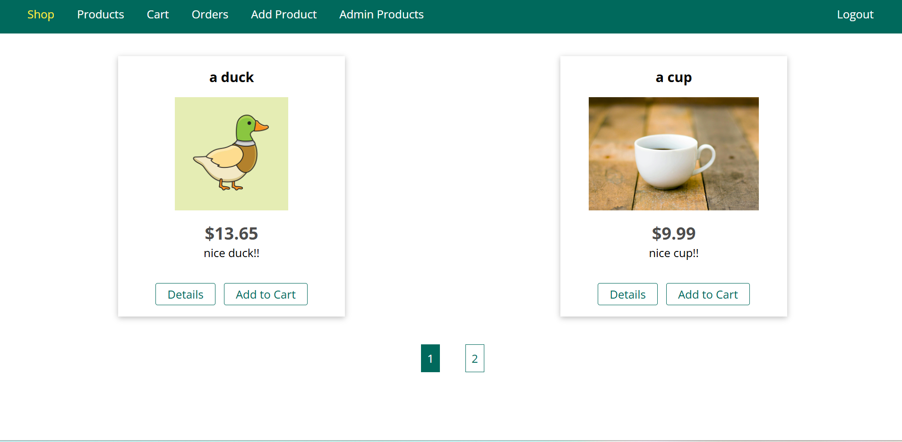
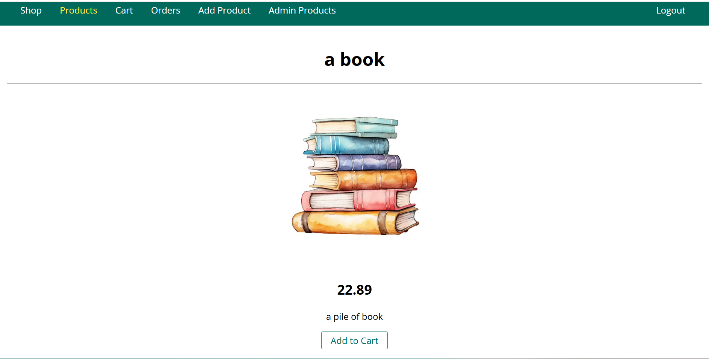
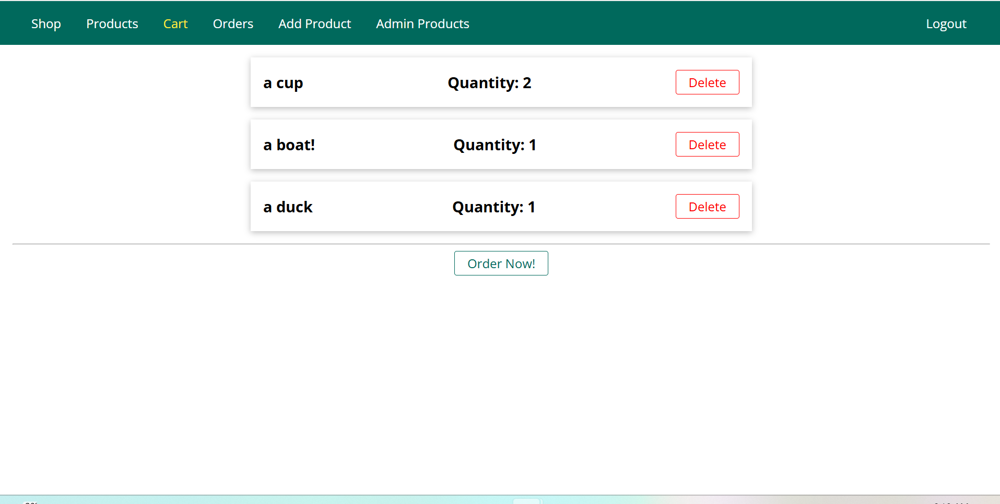
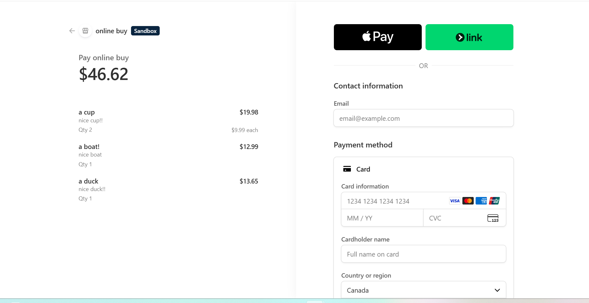
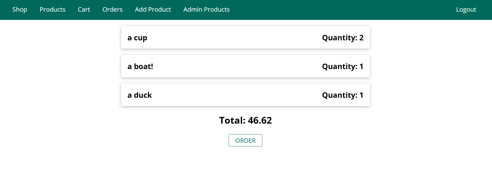

# Node.js Online Shop


A full-stack e-commerce web application built with **Node.js**, **Express**, and **MongoDB** following the MVC architecture.

The application allows users to browse products, manage a shopping cart, securely authenticate, complete payments using Stripe Checkout, generate PDF invoices, and manage orders.

---

## Features

- User authentication (Sign Up / Login / Logout)
- Secure session management
- CSRF protection
- Product management (Create, Edit, Delete)
- Image uploads using Multer
- Shopping cart
- Stripe Checkout integration
- Order history
- Automatic PDF invoice generation
- Pagination
- Error handling
- Input validation

---

## Tech Stack

### Backend

- Node.js
- Express.js
- MongoDB
- Mongoose

### Frontend

- EJS
- HTML
- CSS
- JavaScript

### Authentication & Security

- Express Session
- CSRF
- Helmet
- Connect Flash

### Additional Libraries

- Stripe
- Multer
- PDFKit
- Morgan
- Compression

---

## Project Structure

```
controllers/
middleware/
models/
public/
routes/
views/
images/
app.js
```

The project follows the MVC (Model–View–Controller) architecture to keep routing, business logic, and data models separated.

---

## Screenshots

### Home Page



### Product Details



### Shopping Cart



### Checkout



### Orders



---

## Installation


Install dependencies:

```bash
npm install
```

```

Start the application:

```bash
npm start
```

---

## What I Learned

Through this project I gained hands-on experience with:

- Express.js and MVC architecture
- MongoDB and Mongoose
- Authentication and session management
- RESTful routing
- File uploads
- Payment processing with Stripe
- Security best practices
- PDF generation
- Server-side rendering using EJS

---

## Future Improvements

- Product search
- Product categories
- Product reviews
- Responsive UI improvements
- Docker support
- Deployment to a cloud platform

---

## License

This project was created for educational and portfolio purposes.
